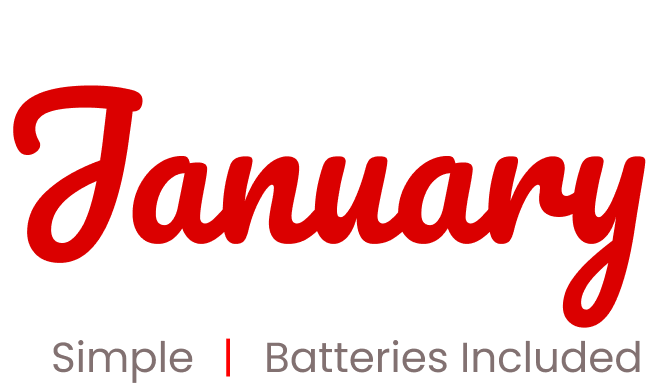

January is Batteries-Included Go Framework inspired by Django. Designed to ease things up for fast development.

### 🎯 Features
* Robust routing
* Serve static files
* Easy access to multiple databases
* Complete user authentication
* Database migrations
* Session support
* Template engines
* Generate handlers
* Middleware support
* Form Validation
* CSRF protection
* Encryption
* Multiple Caching backends
* And much more

